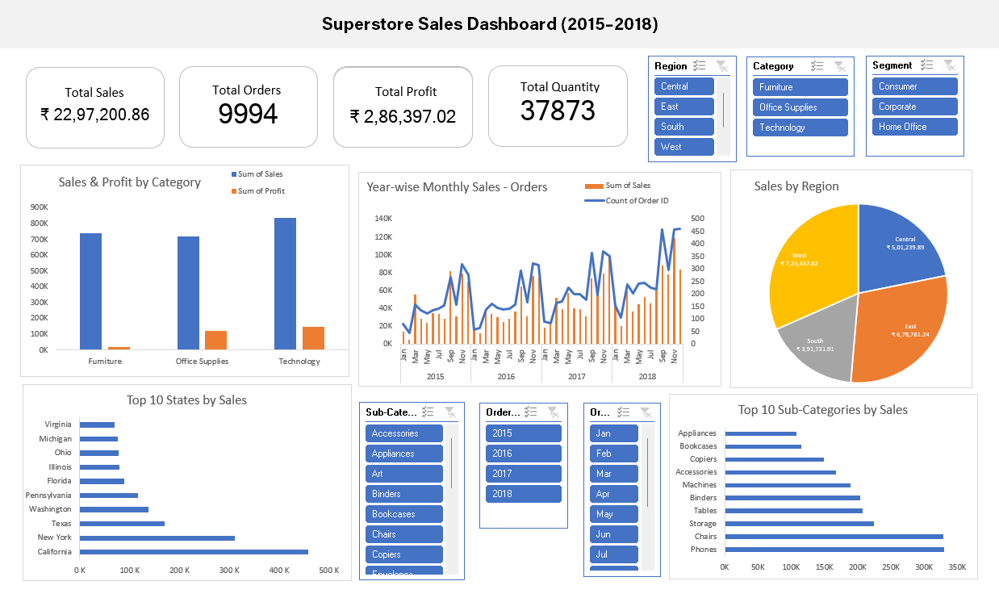

# 📊 Superstore Sales Dashboard (2015–2018)

An interactive Microsoft Excel dashboard built using the Superstore dataset to analyze retail sales performance from **2015 to 2018**. The dashboard provides insights into sales, profit, customer purchasing behavior, regional performance, product categories, and key business metrics through interactive visualizations.

📄 **Project Report:** [Superstore Sales Dashboard (2015–2018).pdf](./Report/Superstore%20Sales%20Dashboard%20Report.pdf)

📊 **Dashboard:** [Excel Dashboard](./Dashboard/Superstore%20Sales%20Dashboard%20(2015%E2%80%932018).xlsx)

---

## 📸 Dashboard Preview



---

## 📋 Executive Summary

This project presents an interactive sales dashboard built using the **Sample Superstore** dataset. It analyzes **9,994 orders** placed between **2015 and 2018**, providing a comprehensive view of sales performance, profitability, customer behavior, product performance, and regional trends.

The dashboard enables users to monitor key business metrics, identify high-performing categories and states, evaluate sales patterns over time, and uncover insights that support informed business decisions.

---

## 📌 Key KPIs

| KPI                    |           Value |
| ---------------------- | --------------: |
| 💰 Total Sales         |      **$2.30M** |
| 📈 Total Profit        |    **$286.40K** |
| 🛒 Total Orders        |       **9,994** |
| 📦 Total Quantity Sold |      **37,873** |
| 📅 Analysis Period     | **2015 – 2018** |

---

## 📊 Dashboard Features

* 📈 Track monthly sales and order trends from **2015–2018**.
* 💰 Compare sales and profit across product categories.
* 🌍 Analyze sales performance by region and state.
* 🏆 Identify the top 10 states and sub-categories by sales.
* 📦 Monitor overall business performance using key KPI cards.
* 🎯 Explore interactive filters for dynamic data analysis.

---

## 💡 Business Insights

* Sales showed an overall upward trend between **2015 and 2018**, indicating consistent business growth.
* The **Technology** category generated the highest sales, making it the top-performing product category.
* A small number of states contributed a significant share of total sales, highlighting key revenue-generating markets.
* Certain sub-categories consistently outperformed others, while a few generated lower sales and profit, indicating opportunities for improvement.
* Regional sales performance varied, suggesting the need for targeted marketing and inventory strategies across different locations.

---

## 📈 Business Recommendations

* Focus marketing efforts on high-performing states to maximize revenue growth.
* Improve the performance of low-selling sub-categories through pricing, promotions, or product optimization.
* Review discount strategies to ensure they contribute to profitability without reducing margins.
* Strengthen inventory planning based on regional demand and product performance.
* Monitor sales and profit trends regularly to support data-driven business decisions.

---

## 🛠️ Tools Used

* **Microsoft Excel**

  * Pivot Tables
  * Pivot Charts
  * Slicers
  * Data Cleaning
  * Dashboard Design

---

## 📂 Project Files

| File                                          | Description                   |
| --------------------------------------------- | ----------------------------- |
| 📊 Superstore Sales Dashboard.xlsx            | Interactive Excel dashboard   |
| 📄 Superstore Sales Dashboard (2015–2018).pdf | Project report with dashboard |
| 📁 Sample-Superstore.xlsx                     | Raw dataset used for analysis |

---

## 📁 Repository Structure

```text
Superstore-Sales-Dashboard/
│
├── Dashboard/
├── Dataset/
├── Images/
├── Report/
├── README.md
└── LICENSE
```

---

⭐ If you found this project helpful or interesting, consider giving the repository a star!
